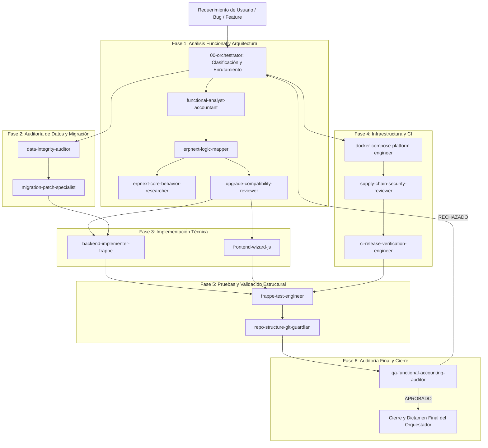

# ORCHESTRATION — Protocolo de Coordinación y Gobernanza de Agentes LEAF ERP

Este documento detalla cómo opera el flujo de trabajo entre los agentes especializados, quién inicia, quién analiza, quién implementa, quién audita, quién valida y quién tiene poder de bloqueo/veto sobre los cambios.

---

## 1. Ciclo de Vida de una Tarea en LEAF ERP



---

## 2. Roles en el Ciclo de Vida

### A. Quién Inicia
- **`orchestrator`**: Recibe el requerimiento inicial, clasifica el alcance (Funcional / Datos / Plataforma / Crítico), asigna el nivel arquitectónico (1 al 5) y activa exclusivamente a los especialistas necesarios.

### B. Quién Analiza
- **`functional-analyst-accountant`**: Modela las reglas de negocio, contabilidad de doble partida e impacto fiscal para Honduras (SAR/SEFIN).
- **`erpnext-logic-mapper`**: Ejecuta el *Native Path Check* (10 preguntas obligatorias) y mapea entidades de negocio a DocTypes nativos.
- **`erpnext-core-behavior-researcher`**: Inspecciona el código fuente real de Frappe/ERPNext para verificar controllers, hooks y métodos internos.
- **`upgrade-compatibility-reviewer`**: Evalúa el riesgo de merge frente a futuros upgrades upstream mediante la escala A ➔ E.

### C. Quién Audita Datos
- **`data-integrity-auditor`**: Determina **QUÉ** datos existen, qué registros sometidos (`docstatus=1`) deben congelarse y qué campos son la fuente de verdad.
- **`migration-patch-specialist`**: Diseña el **CÓMO** ejecutar las transformaciones y parches idempotentes (`patches.txt`).

### D. Quién Implementa
- **`backend-implementer-frappe`**: Escribe controladores Python, hooks y servicios transaccionales en la Custom App LEAF.
- **`frontend-wizard-js`**: Desarrolla la capa de interacción UX en Frappe Desk y Client Scripts consumiendo los endpoints de backend.
- **`docker-compose-platform-engineer`**: Modifica infraestructura Docker, compose, buildx bake y servicios.

### E. Quién Valida y Prueba
- **`frappe-test-engineer`**: Diseña y ejecuta la matriz de pruebas en las **7 Dimensiones de Cobertura** (Estándar, LEAF, Integración, Regresión, Históricos, Negativos, End-to-End).
- **`ci-release-verification-engineer`**: Verifica workflows de CI, linters, pre-commit y reproducibilidad de imágenes.
- **`repo-structure-git-guardian`**: Valida rutas relativas exactas, sincronización de JSON de DocTypes, higiene de Git y atomicidad de commits.

### F. Quién Audita y Emite Veredicto Final
- **`qa-functional-accounting-auditor`**: Actúa como la compuerta final e independiente. Revisa que no exista duplicación de motores nativos, que cuadre GL Entry y emite el dictamen final (`APROBADO` / `APROBADO CON OBSERVACIONES` / `RECHAZADO`).

---

## 3. Matriz de Poder de Bloqueo (Quién Puede Vetar)

| Agente con Poder de Bloqueo | Condición de Bloqueo / Veto |
| :--- | :--- |
| **`qa-functional-accounting-auditor`** | Puede vetar cualquier desarrollo si duplica funcionalidad nativa, corrompe datos históricos, desbalancea contabilidad o incumple la regla de reversibilidad en `on_cancel`. |
| **`data-integrity-auditor`** | Puede bloquear si se pretenden modificar registros históricos cerrados (`docstatus=1`) sin estrategia de preservación o si hay riesgo de pérdida de integridad referencial. |
| **`upgrade-compatibility-reviewer`** | Puede bloquear propuestas de modificación directa de Core (Fork / Categoría E) o overrides de métodos si existen alternativas de Nivel 1, 2 o 3. |
| **`supply-chain-security-reviewer`** | Puede bloquear cambios de infraestructura si detecta exposición de secretos, imágenes inseguras o dependencias sin pin de versión. |

---

## 4. Rutas de Enrutamiento por Niveles de Cambio

### NIVEL 1 (Cambio Simple — UI / Etiquetas)
```text
orchestrator ➔ erpnext-logic-mapper ➔ frontend-wizard-js ➔ repo-structure-git-guardian
```

### NIVEL 2 (Cambio Funcional Estándar)
```text
orchestrator ➔ functional-analyst-accountant ➔ erpnext-logic-mapper ➔ erpnext-core-behavior-researcher ➔ upgrade-compatibility-reviewer ➔ backend-implementer-frappe y/o frontend-wizard-js ➔ frappe-test-engineer ➔ qa-functional-accounting-auditor ➔ repo-structure-git-guardian
```

### NIVEL 3 (Cambio con Datos Existentes / Migración)
```text
orchestrator ➔ functional-analyst-accountant ➔ erpnext-logic-mapper ➔ data-integrity-auditor ➔ migration-patch-specialist ➔ backend-implementer-frappe ➔ frappe-test-engineer ➔ qa-functional-accounting-auditor ➔ repo-structure-git-guardian
```

### NIVEL 4 (Infraestructura / Plataforma Docker / CI)
```text
orchestrator ➔ docker-compose-platform-engineer ➔ supply-chain-security-reviewer ➔ ci-release-verification-engineer ➔ frappe-test-engineer ➔ repo-structure-git-guardian
```

### NIVEL 5 (Cambio Crítico — Contabilidad, Inventario, Impuestos, Saldos)
```text
Activa obligatoriamente a TODOS los especialistas aplicables de análisis funcional, lógica nativa, código backend/frontend, integridad de base de datos, parches, pruebas exhaustivas y auditoría final QA.
```
